# Отчет по практическому заданию
## Создание каталога товаров на FastAPI + SQLite + HTML/CSS/JS

## Содержание
- [Цель работы](#цель-работы)
- [Используемые технологии](#используемые-технологии)
- [База данных](#база-данных)
- [Серверная часть (Backend)](#серверная-часть-backend)
- [Клиентская часть (Frontend)](#клиентская-часть-frontend)
- [API документация (Swagger)](#api-документация-swagger)
- [Интерфейс пользователя](#интерфейс-пользователя)
- [Инструкция по запуску](#инструкция-по-запуску)
- [Вывод](#вывод)

## Цель работы

Создать полнофункциональное веб-приложение для каталога товаров, состоящее из:
- Серверной части на **FastAPI** с маршрутами `/products/all` и `/products/get/{id}`
- Базы данных **SQLite3** со связанными таблицами
- Клиентской части на **HTML/CSS/JavaScript**
- Документации API через **Swagger**

## Используемые технологии

### Backend
| Технология | Назначение |
|------------|------------|
| **Python 3.10+** | Язык программирования |
| **FastAPI** | Веб-фреймворк |
| **SQLAlchemy** | ORM для работы с БД |
| **SQLite3** | База данных |
| **Pydantic** | Валидация данных |
| **Uvicorn** | ASGI сервер |

### Frontend
| Технология | Назначение |
|------------|------------|
| **HTML5** | Структура страницы |
| **CSS3** | Стилизация |
| **JavaScript** | Клиентская логика |
| **Fetch API** | Запросы к серверу |

    
## База данных
Модели данных (models.py)

from sqlalchemy import Column, Integer, String, Float, ForeignKey, Text, DateTime
from sqlalchemy.orm import relationship
from datetime import datetime
from database import Base

class Category(Base):
    __tablename__ = 'categories'
    
    id = Column(Integer, primary_key=True, index=True)
    name = Column(String(100), nullable=False)
    description = Column(Text)
    created_at = Column(DateTime, default=datetime.utcnow)
    
    products = relationship("Product", back_populates="category")

class Product(Base):
    __tablename__ = 'products'
    
    id = Column(Integer, primary_key=True, index=True)
    name = Column(String(200), nullable=False)
    description = Column(Text)
    price = Column(Float, nullable=False)
    stock = Column(Integer, default=0)
    category_id = Column(Integer, ForeignKey('categories.id'))
    image_url = Column(String(500))
    created_at = Column(DateTime, default=datetime.utcnow)
    
    category = relationship("Category", back_populates="products")

Структура таблиц в SQLite
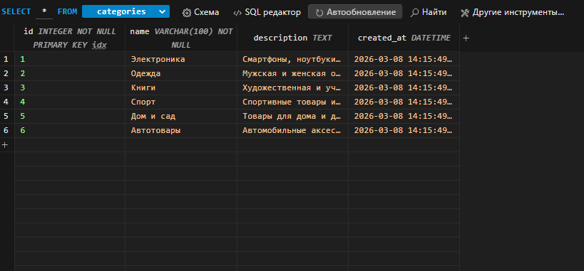

*Рисунок 1 - Таблица в SQLite Viewer*

## Серверная часть (Backend)

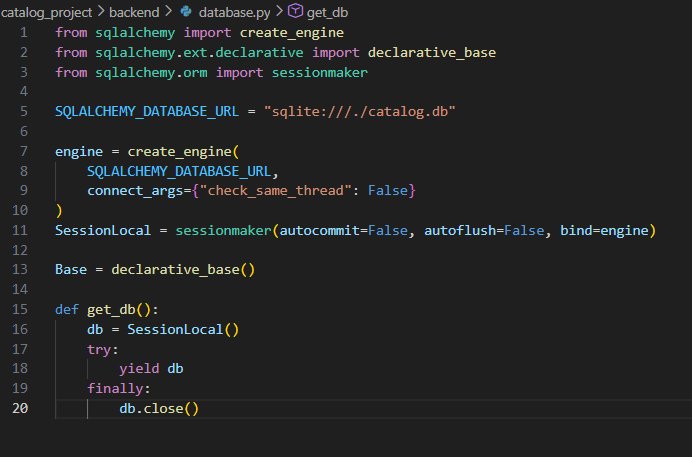

*Рисунок 2 - Код файла database.py*

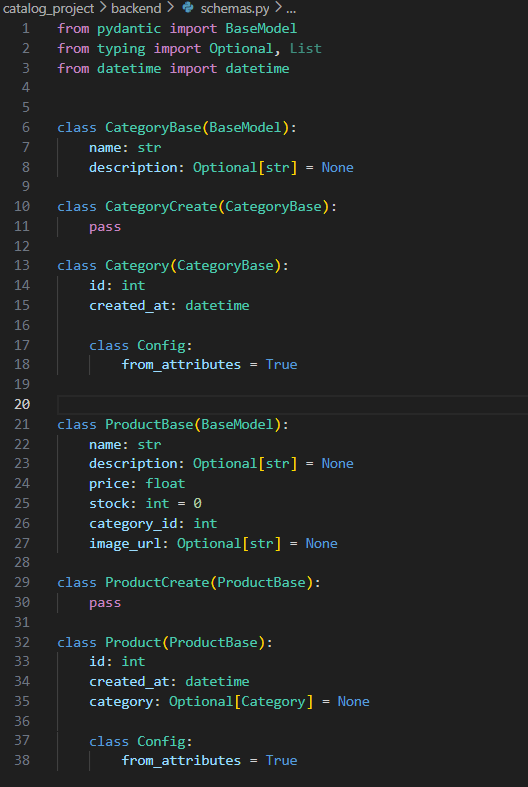

*Рисунок 3 - Код файла schemas.py*

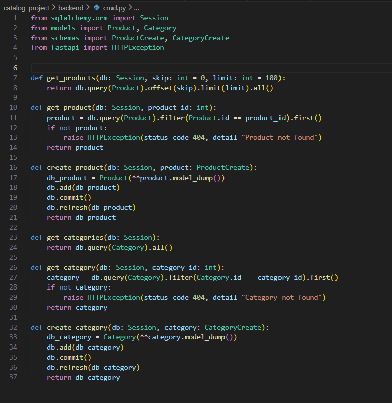

*Рисунок 4 - Код файла crud.py*

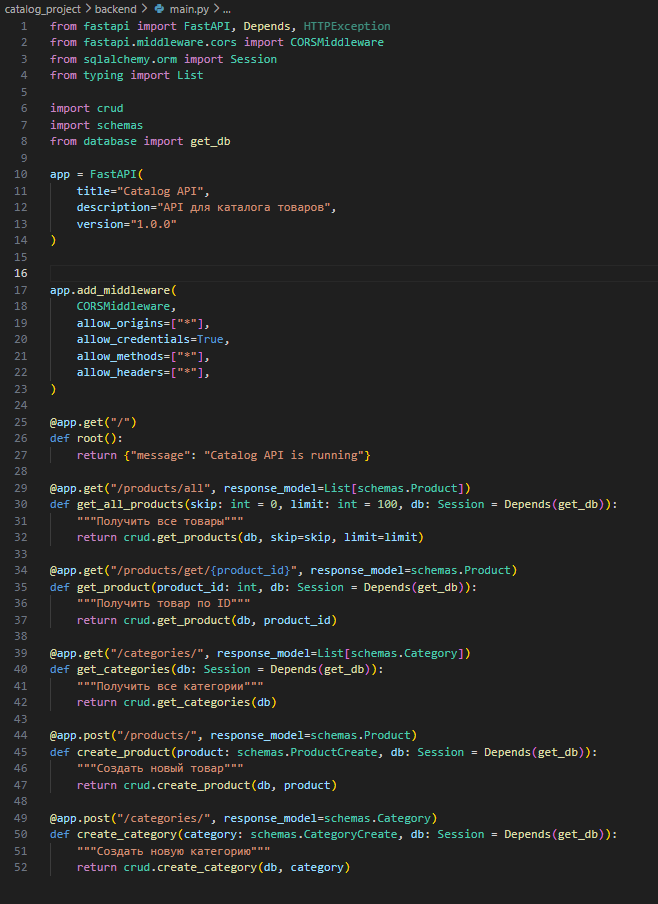

*Рисунок 5 - Код файла main.py*

## Клиентская часть (Frontend)

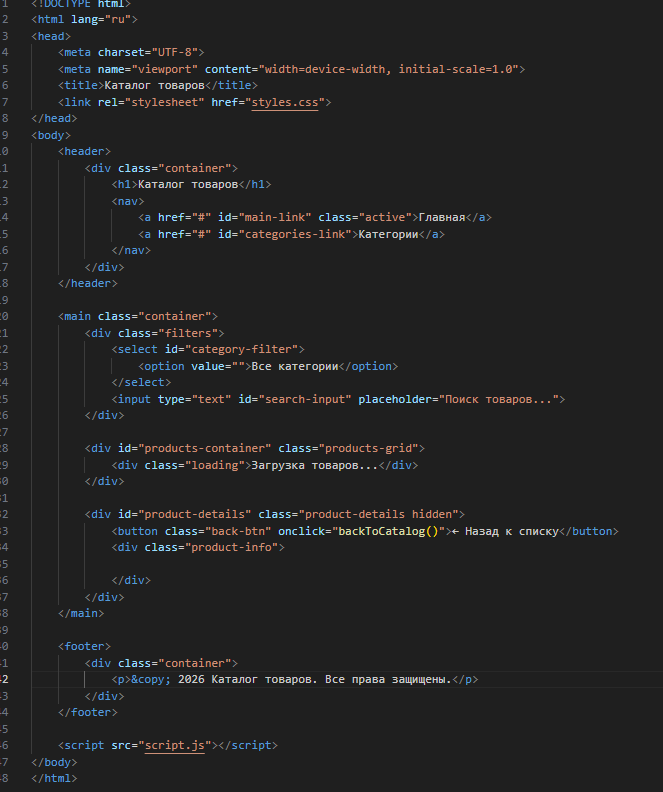

*Рисунок 6 - Код файла index.html*

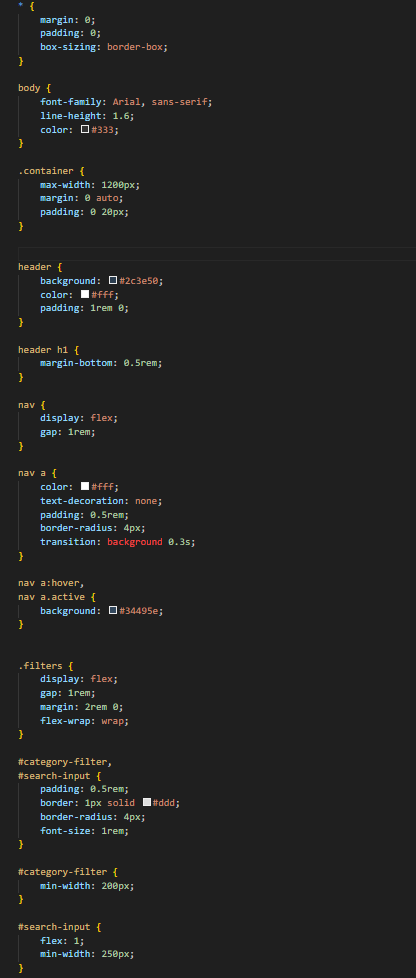
*Рисунок 7 - Код файла styles.css*

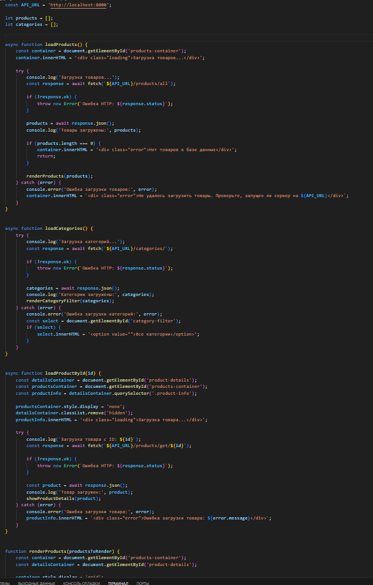
*Рисунок 8 - Код файла script.js*

## API документация (Swagger)

Главная страница Swagger UI
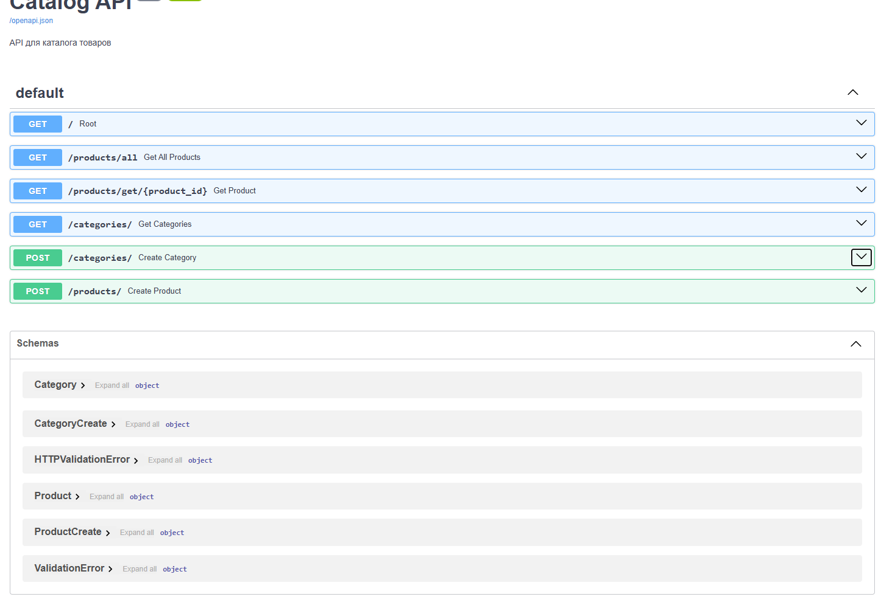

*Рисунок 9 - Главная страница Swagger документации*

Эндпоинт /products/all
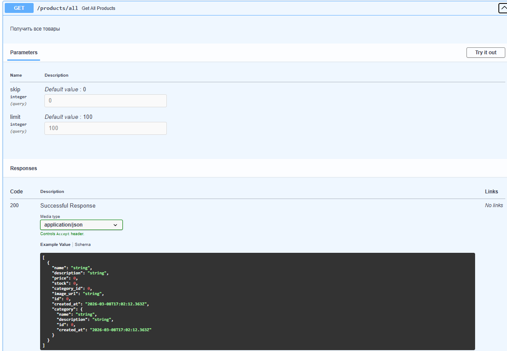

*Рисунок 10 - Документация эндпоинта получения всех товаров*

Эндпоинт /products/get/{id}
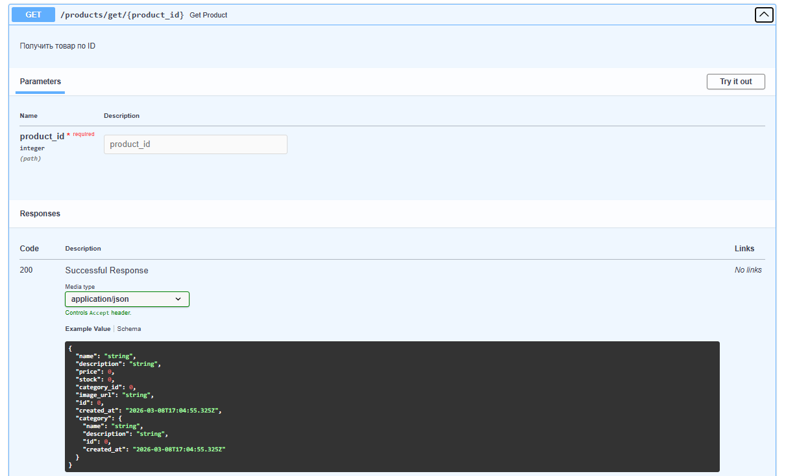

*Рисунок 11 - Документация эндпоинта получения товара по ID*

## Интерфейс пользователя

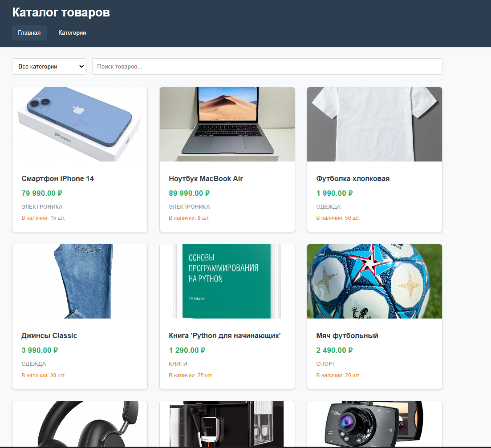

*Рисунок 12 - Главная страница с сеткой товаров*

## Инструкция по запуску
Требования
Python 3.8 или выше

SQLite3 (встроен в Python)

Современный браузер

Пошаговая инструкция
1. Клонирование репозитория
git clone 
cd catalog_project
2. Настройка backend
# Переход в папку backend
cd backend

# Создание виртуального окружения
python -m venv venv

# Активация виртуального окружения (Windows)
venv\Scripts\activate

# Установка зависимостей
pip install -r requirements.txt

3. Запуск миграций

python migrations/init_db.py

4. Запуск сервера
uvicorn main:app --reload

5. Открытие фронтенда

Откройте браузер

Нажмите Ctrl+O

Выберите файл frontend/index.html

## Вывод
В ходе выполнения практического задания было создано полнофункциональное веб-приложение "Каталог товаров", состоящее из:

Backend: REST API на FastAPI с эндпоинтами для получения всех товаров и товара по ID

База данных: SQLite с двумя связанными таблицами (categories и products)

Frontend: Адаптивный интерфейс на HTML/CSS/JS с возможностью фильтрации и поиска

Все требования задания выполнены в полном объеме. Приложение успешно запускается и работает локально. Документация API доступна через Swagger UI.

